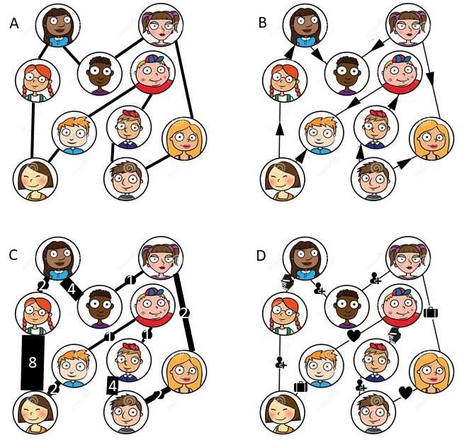

```{r setup, include=FALSE}
knitr::opts_chunk$set(echo = TRUE)
knitr::opts_chunk$set(warning = FALSE)
knitr::opts_chunk$set(message = FALSE)
knitr::opts_chunk$set(fig.width=6, fig.height=3, fig.align="center") 
knitr::opts_knit$set(root.dir = rprojroot::find_rstudio_root_file())
# dependencies
library(tidyverse)
```

# What is a Network?

A network is a _graph_ which describes how entities (i.e. vertices or nodes) interact with one another (i.e. through edges or links). One of the most commonly discussed examples is a social network which describes how individuals form friendships among one another. In this case, the individuals are embodied by the nodes of the network and an edge between the nodes signifies the existence of a friendship.

Consider this set of ten individuals, and suppose they are organized in the following social network:

<center>


</center>

The goal of this tutorial is to walk through how to construct such networks (along with other common generalizations) in `R` with `igraph` before briefly outlining some functionality for analyzing such graphs. 

To get started, we will load the `igraph` package.

```{r}
library(igraph)
```

# Reconstructing the Network

There are a few ways to construct a network with `igraph`. We will walk through three commonly used cases. In practice, you use whichever method is easiest depending on how the data are presented to you.

## with Adjacent Nodes

In the case when we are given a pictorial representation of the graph, it is likely easiest to reconstruct it in `R` by providing _adjacent nodes_. That is, we would create the network by inputting the pairs of nodes which are connected by an edge. 

For clarity, I've withheld a space between individuals in the code if those two individuals are adjacent. Clearly, the order of the individuals matter but the order of the pairs of individuals do not matter when constructing a graph.

```{r}
g1 <- graph(edges = c('Kat','Ty', 'Ty','Viv', 'Viv','Dee', 'Dee','Chet', 
                      'Chet','Josh', 'Josh','Ron', 'Ron','Drew', 'Drew','Quinn', 
                      'Quinn','Lucy', 'Lucy','Kat'),
            directed = FALSE)
```

Once the graph is created, we can access the nodes with `V()` and the edges with `E()`. We can count the number of nodes with `vcount()` and the edges with `ecount()`.

```{r}
V(g1) # access nodes
E(g1) # access edges

vcount(g1) # count number of nodes
ecount(g1) # count number of edges
```

Once the graph is created, we can plot it with `plot()`. There are a plethora of plotting options available to you. Since visualization is not the scope of this tutorial, I'll refer you to the [`igraph` plotting manual](https://igraph.org/r/doc/plot.common.html). For those of you who prefer the `ggplot` look and syntax (like myself), I recommend the [`ggnetwork` package](https://briatte.github.io/ggnetwork/) which provides the needed geometries to plot networks with `ggplot`.

```{r, fig.height=4, fig.width=4}
library(ggnetwork)
ggplot(ggnetwork(g1),
       aes(x = x, y = y, xend = xend, yend = yend, label = name)) +
  geom_edges(color = 'gray', size = 1) +
  geom_nodes(size = 12, color = 'steelblue') +
  geom_nodetext(color = 'white', size = 3) +
  theme_blank()
```
<center>
Figure 2: the same simple undirected graph from Figure 1 constructed in `R`

</center>

As it turns out, this social network is actually a _ring_.

While it may not be obvious, based on the way we constructed `g1` each node is given an attribute (name) which we can access or to which we can assign new values (perhaps to correct a misspelled name).

```{r}
get.vertex.attribute(g1)
g1 <- set.vertex.attribute(g1, 
                           name = 'name', # name of attribute
                           index = which(V(g1)$name == 'Kat'), # which nodes
                           value = 'Kit') # what values should the node(s) take
V(g1)$name
```

The `set.` functions can also be used to add attributes to the graph (either to the nodes or to the edges) when _graph metadata_ are available. To exemplify this, we will add each individuals age as a node attribute.

```{r}
V(g1)
g1 <- set.vertex.attribute(g1, 
                           name = 'age',
                           index = V(g1),
                           value = c(22, 21, 25, 26, 24, 21, 17, 18, 22, 20))
V(g1)$age
```

__Note__, when using the `set.` functions, the graph must be assigned to a variable to save any corrections or additions.

## with an Adjacency Matrix

Aside from inputting adjacent nodes, another way you can construct a graph with `igraph` is with an _adjacency matrix_ which is 1 in the $(i,j)$ element if the $i$th node and the $j$th node are adjacent and 0 otherwise.

After the construction or the retrieval of the adjacency matrix, you can create the graph object with `graph_from_adjacency_matrix()`.

```{r}
# construct adjacency matrix for ring
g2_adj <- diag(0, 10)
g2_adj[abs(row(g2_adj) - col(g2_adj)) == 1] <- 1
g2_adj[1,10] <- g2_adj[10,1] <- 1
dimnames(g2_adj) <- rep(list(c('Kit','Ty','Viv','Dee','Chet','Josh',
                               'Ron','Drew','Quinn','Lucy')), 2)
g2_adj

# create graph from adjacency matrix
g2 <- graph_from_adjacency_matrix(g2_adj, mode = 'undirected')
```

Rather than plot the graph constructed from the adjacency matrix, we can check the equality of the edges to show it is the same as the one constructed from pairs of adjacent nodes.

```{r}
all(E(g1) == E(g2))
```

While pleasant to work with in theory, adjacency matrices become computationally intractable for large networks. The following is the last covered method for constructing a network with `igraph` and is preferred over all others.

## with an Edge and Node List

When working with large networks, you will need to construct the network in `igraph` with an edge list and a node list. The _edge list_ requires at least two columns: `from` and `to`. For _directed networks_ where edges have direction associated with them (e.g. Kit befriended Ty), the sender (e.g. Kit) would be the `from` node and the receiver (e.g. Ty) would be the `to` node. For _undirected networks_ where edges have no direction associated with them (e.g. Kit and Ty are friends), the order of adjacent nodes are meaningless. Aside from `from` and `to`, any other columns in the edge list will be included as edge attributes. Edge attributes are helpful for creating more general graphs.

The _node list_ is only necessary when there is node metadata you would like to include in/on the network. We have information of each individual's age, gender, and relationship status, so a node list will be useful in incorporating this information as node attributes. The node list should have as many rows as there are number of nodes. The first column must consist of the node identifiers (i.e. the same keys used in the edge list for `from` and `to`). Aside from that, any other columns will be included as node attributes.

```{r}
edge_lst <- read_csv('./src/sn_edges.csv')
node_lst <- read_csv('./src/sn_nodes.csv')

head(edge_lst[,1:2])
head(node_lst[,1:4])
```

After the edge and node lists are constructed, you can use them to create a graph with `graph_from_data_frame()`. Again, we can check the equality of the edges to show it is the same as the graphs constructed using the prior methods.

```{r}
g3 <- graph_from_data_frame(d = edge_lst, vertices = node_lst, directed = FALSE)
all(E(g1) == E(g3)) # g1 was already shown to be equal to g2
```

# Constructing More General Networks

In the previous section, we explored three `igraph` functions for creating networks and `R`. We also outlined how to access and edit node and edge attributes for existing graphs as well as add attributes. What we did not explore is how to use these attributes to create more general networks than the simple undirected network presented again in Figure 3A. The observed social network could be more complex as in Figures 3B-D. 

<center>


</center>

In Figure 3B, the edges are directional making it a _directed graph_ which can be captured by ensuring the adjacent nodes are properly listed as `from` (e.g. Kit) and `to` (e.g. Ty) in the edge list and specifying that `directed = TRUE`.

```{r}
head(edge_lst)[,1:2] # proper order
gB <- graph_from_data_frame(d = edge_lst, vertices = node_lst, directed = TRUE)
```

In Figure 3C, edges maintain a positive, quantitative value indicating the length of the relationship (lor) between adjacent nodes. This edge attribute can be used as a _weight_ to create a _weighted undirected network_. To create a weighted network in `igraph`, we need to specify an edge attribute called weight. This is as easy as renaming the lor attribute to weight and creating a graph. __Note__, the only way to create a weighted graph is to create a graph with an attribute named weight.

```{r}
head(edge_lst[,1:3])
gC <- graph_from_data_frame(d = edge_lst, vertices = node_lst, directed = FALSE)
gC <- set.edge.attribute(gC, name = 'weight', index = V(gC), value = E(gC)$lor)
E(gC)$weight
```

To check if a graph is weighted, you can use `is_weighted()`.

```{r}
is_weighted(gB) # gB is not weighted
is_weighted(gC) # but gC is weighted
```
Similarly, you can use `is_directed()` to check if a graph is directed.

```{r}
is_directed(gB) # gB is directed
is_directed(gC) # but gC is not directed
```

Lastly, we'll consider how to create the graph is Figure 3D. In this case, the edges are categorically valued to indicated the type of relationship (tor) between adjacent nodes. The edge types are encoded as an edge attribute.
When nodes and edges are categorically valued, then the network is called _heterogeneous_. There is a [vast amount of research](https://www.sciencedirect.com/topics/computer-science/heterogeneous-networks) on how to leverage the information contained within these labels. 

```{r}
head(edge_lst[,c(1, 2, 4)])
gD <- graph_from_data_frame(d = edge_lst, vertices = node_lst, directed = FALSE)
```

The graphs can then be visualized in `R` to mimic their cartoon depiction. Here, I've incorporated the individual's age and gender as node information in Figure 3D.

```{r, echo = FALSE, fig.width=6, fig.height=7}
addSmallLegend <- function(myPlot, pointSize = 0.5, textSize = 3, spaceLegend = 0.1) {
    myPlot +
        guides(shape = guide_legend(override.aes = list(size = pointSize)),
               color = guide_legend(override.aes = list(size = pointSize))) +
        theme(legend.title = element_text(size = textSize), 
              legend.text  = element_text(size = textSize),
              legend.key.size = unit(spaceLegend, "lines"))
}

p1 <- ggplot(ggnetwork(g1),
       aes(x = x, y = y, xend = xend, yend = yend, label = name)) +
  geom_edges(color = 'gray', size = 1) +
  geom_nodes(size = 10, color = 'steelblue') +
  geom_nodetext(color = 'white', size = 3) +
  theme_blank()

p2 <- ggplot(ggnetwork(gB),
       aes(x = x, y = y, xend = xend, yend = yend, label = name)) +
  geom_edges(arrow = arrow(length = unit(12, "pt"), type = "closed"), 
             color = 'gray', size = 1) +
  geom_nodes(size = 10, color = 'steelblue') +
  geom_nodetext(color = 'white', size = 3) +
  theme_blank()

p3 <- ggplot(ggnetwork(gC),
       aes(x = x, y = y, xend = xend, yend = yend, label = name)) +
  geom_edges(aes(size = weight), color = 'gray') +
  geom_nodes(size = 10, color = 'steelblue') +
  geom_nodetext(color = 'white', size = 3) +
  theme_blank() +
  theme(legend.position = 'bottom')

p4 <- ggplot(ggnetwork(gD),
       aes(x = x, y = y, xend = xend, yend = yend, label = name)) +
  geom_edges(aes(linetype = tor), color = 'gray', size = 1) +
  geom_nodes(aes(shape = gender, color = age), size = 10) +
  geom_nodetext(color = 'white', size = 3) +
  scale_linetype_manual('type', values = c('solid', 'longdash', 'dotdash', 'dotted')) +
  theme_blank() +
  theme(legend.position = 'bottom',
        legend.direction = 'vertical')

ggpubr::ggarrange(p1, p2, 
                  addSmallLegend(p3, pointSize = 1, textSize = 8), 
                  addSmallLegend(p4,pointSize = 1, textSize = 8), 
                  labels = LETTERS[1:4],
                  heights = c(1, 1.5))
```
<center>
Figure 4: networks which represent their cartoon counterparts and are created in `R`. Panel D is created to incorporate node information.

</center>

# Interacting with Networks

Network analysis is an active area of research. Despite the constantly evolving nature of network analysis, `igraph` not only allows you to create graphs in `R` but to interact with them with commonly used methods and metrics. The [documentation](https://igraph.org/r/doc/) is expansive, so I have thumbed through and pulled out functions that are commonly used in practice and in research.

Broadly speaking, I have organized these functions by a goal. _Traverse_ is used for any function that returns nodes, edges, or a graph in which the result was attained by moving along the original graph. _Convert_ is used for functions which facilitate the change in representation of a graph. _Simplify_ is used to reduce the size of a graph either through the removal of nodes and/or edges or by considering a subgraph. Finally, _analyze_ is used to illustrate that a function defines some metric on the graph (either on the nodes, edges, or globally).

```{r, echo = FALSE}
df_fns <- data.frame(
  Goal = c(
    'traverse',
    'convert',
    'analyze',
    'analyze',
    'traverse',
    'analyze',
    'analyze',
    'analyze',
    'analyze',
    'analyze',
    'analyze',
    'analyze',
    'analyze',
    'traverse',
    'analyze',
    'convert',
    'simplify',
    'traverse',
    'analyze',
    'traverse',
    'analyze',
    'traverse',
    'analyze',
    'simplify',
    'simplify',
    'analyze',
    'convert',
    'analyze',
    'traverse',
    'simplify',
    'analyze',
    'traverse'
  ),
  Function = c(
    'all_shortest_paths()',
    'as_adj()',
    'betweenness()',
    'cohesion()',
    'cliques()',
    'closeness()',
    'components()',
    'degree()',
    'diameter()',
    'distances()',
    'diversity()',
    'eccentricity()',
    'eigen_centrality()',
    'farthest_vertices()',
    'knn()',
    'laplacian_matrix()',
    'make_ego_graph()',
    'neighborhood()',
    'page_rank()',
    'permute()',
    'radius()',
    'random_walk()',
    'reciprocity()',
    'scg()',
    'simplify()',
    'spectrum()',
    'stochastic_matrix()',
    'strength()',
    'subcomponent()',
    'subgraph()',
    'transitivity()',
    'triangles()'
  ),
  Description = c(
    'Calculates one shortest path (the path itself, and not just its length) from or to the given vertex.',
    'Converts a graph to an adjacency matrix.',
    'Computes the vertex and edge betweenness centrality.',
    'Calculates the group cohesion or vertex connectivity of a graph or two vertices.',
    'Finds all cliques in an undirected graph.',
    'Measures the closeness centrality or how many steps is required to access every other vertex from a given vertex.',
    'Calculates the maximal (weakly or strongly) connected components of a graph.',
    'Computes the number of adjacent edges for given vertices in a graph.',
    'Returns the diameter of a graph or the length of the longest geodesic.',
    'Finds the length of all shortest paths from or to the vertices in the graph.',
    'Measures the diversity for given vertices in a graph.',
    'Returns the eccentricty for given vertices or the shortest path distance from the farthest other node in the graph.',
    'Calculates the eigenvector centralities (or the values of the first eigenvector) a graph.',
    'Finds the vertices which yield the diameter of the graph.',
    'Computes the average nearest neighbor degree of the given vertices.',
    'Returns the Laplacian of a graph.',
    'Creates subgraphs from all neigborhoods of the given vertices. Often used with `connect()` to create a new graph by connecting each vertex to all other vertices in its neighborhood.',
    'Finds the neighboorhood of given verticies by returning the vertices not farther than a given limit from another fixed vertex. While a helper function for `make_ego_graph()`, it is sometimes useful on it\'s own.',
    'Calculates the Google PageRank for the specified vertices.',
    'Create a new graph, by permuting vertex ids. This is useful for permutation testing.',
    'Returns the radius of a graph or the smallest eccentricity of a graph.',
    'Conducts a random walk over the graph.',
    'Computes the reciprocity or the proportion of mutual connections in a directed graph.',
    'Performs spectral coarse graining of a graph to reduce the size of a graph while preserving their spectral related features.',
    'Removes loops and/or multiple edges from a graph.',
    'Calculates selected eigenvalues and eigenvectors of the adjacency matrix of a graph.',
    'Retrieves the stochastic matrix of a graph.',
    'Computes the strength of vertices in a graph or the sum of the edge weights of the adjacent edges for a fixed vertex.',
    'Finds all vertices reachable from a given vertex.',
    'Creates a subgraph of a graph containing only the specified vertices and all the edges among them.',
    'Measures the global and/or local transitivity (also known as clustering coefficent) of a graph. This is the probability that the adjacent vertices of a vertex are connected.',
    'Lists all triangles of a graph. For efficiency, all triangles are returned in a single vector. The first three vertices belong to the first triangle, etc.'
  )
)

DT::datatable(df_fns)
```

